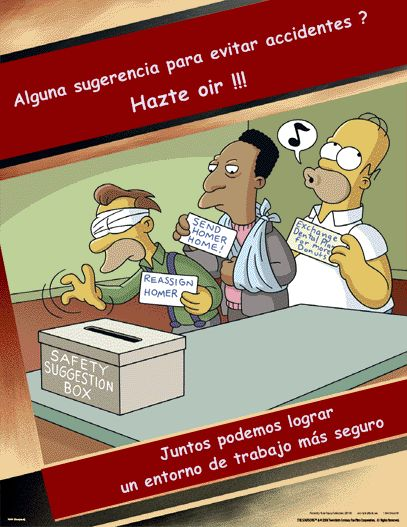

<!--texto que pondiras tu -->

<!--hablar sobre la importancia de la prevencion de los riesgos laborales-->

<!--he pensado en ir enumerando los peligros con cada foto yu asi es mas interctivo-->

<!--puedes habra sobrte el pleigro de enchufar multiples cosas en un solo enchufe o sobrecarga de luz o algo asi-->

<!--hablar sobre los cursos de prevencion que la empresa da-->

<!--para la proteccion de ojos, no he encontrado ninguna de una pantalla pero esta me gusta yua tu decides si ponerla o no -->

<!--tambein podriamos añadir primeros auxilios y cosas asi-->

<!--podemos poner tambien al final esto y ya como tu veas le metes txt -->

